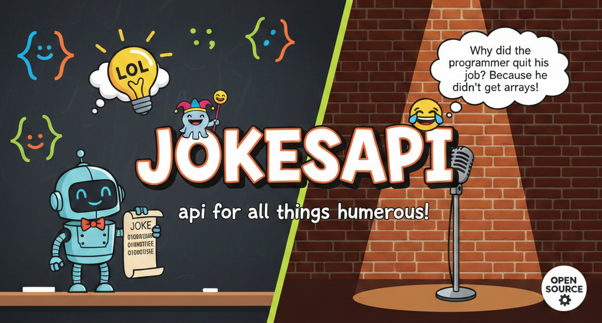

# JokesAPI 🎭

A full-stack web application built with Flask that allows users to share, browse, and interact with jokes. Features user authentication, personalized dashboards, and a RESTful API.



## ✨ Features

- **User Authentication** – Register, login, and manage your profile (Flask-Login)
- **Joke Management** – Add, view, and delete your own jokes
- **Like System** – Show appreciation for jokes you enjoy
- **Category Browsing** – Filter jokes by category (programming, dad, punny, etc.)
- **Dashboard** – Personal stats and quick access to your jokes
- **Pagination** – Efficiently browse large joke collections
- **Responsive Design** – Works on desktop and mobile (Bootstrap 5)
- **RESTful API** – Programmatic access to jokes (same backend)

## 🛠️ Tech Stack

- **Backend**: Python, Flask, Flask-SQLAlchemy, Flask-Login, Flask-WTF
- **Frontend**: HTML5, Jinja2, CSS, JavaScript
- **Database**: SQLite (development) / PostgreSQL (production ready)
- **Authentication**: Werkzeug security (password hashing)
- **Forms**: WTForms with CSRF protection

## 📦 Installation

### Prerequisites
- Python 3.8+
- pip
- Virtual environment (recommended)

### Steps

1. **Clone the repository**
   ```bash
   git clone https://github.com/AridsWolfgang/JokesAPI.git
   cd JokesAPI